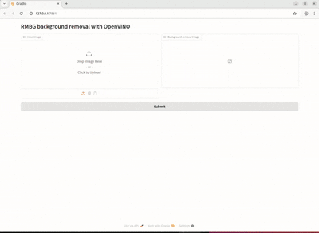

# AI 배경 제거

-----

## 📸 소개

깔끔하고 전문적인 사진이 필요한데 배경 때문에 고민했던 적이 있으신가요? 저희 AI 배경 제거 도구가 여러분의 고민을 해결해 드립니다! 이 프로젝트는 **인공지능**의 힘을 활용하여 이미지에서 배경을 즉시 제거해 줍니다. 따라서 증명사진, 제품 사진 또는 깔끔하고 방해받지 않는 이미지가 필요한 모든 상황에 완벽하게 활용될 수 있습니다. 지저분한 배경에 작별을 고하고 선명하고 깨끗한 비주얼을 만나보세요!

-----

## 🚀 사용 방법

AI 배경 제거 도구를 시작하는 것은 매우 간단합니다! 다음 단계에 따라 설정하고 실행해 보세요.

### 설정

먼저, 필요한 패키지를 설치해야 합니다. 터미널을 열고 다음 명령어를 실행하세요:

```bash
pip install -r requirements.txt
```

### 애플리케이션 실행

1.  **메인 스크립트 실행:**  
    패키지 설치 후, 메인 애플리케이션 파일을 실행합니다:

    ```bash
    python main.py
    ```

2.  **Gradio 웹 인터페이스 실행:**  
    `main.py`가 실행되면 터미널에 다음과 같은 로컬 URL이 표시됩니다:

    ```
    Running on local URL: http://127.0.0.1:7861
    ```

    이 URL을 **Ctrl-클릭 (macOS에서는 Cmd-클릭)** 하면 브라우저에서 웹 인터페이스가 열립니다.

3.  **업로드 및 처리:**  
    웹 인터페이스에서 **처리하고 싶은 사진을 업로드**합니다. 그런 다음 "**Submit**" 버튼을 클릭합니다. 잠시 후, 배경이 제거된 새로운 이미지가 나타날 것입니다!

-----

## ✨ 예시

AI 배경 제거 기능이 작동하는 모습을 직접 확인해 보세요!





-----


## 📄 라이선스

이 프로젝트는 [MIT 라이선스](https://www.google.com/search?q=LICENSE)를 따릅니다.

-----

## 📧 연락처

궁금한 점이 있거나 연락하고 싶으신가요? 

[안진홍] - [ajh9703@gmail.com]
[박명우] - [michaelmw@naver.com]


